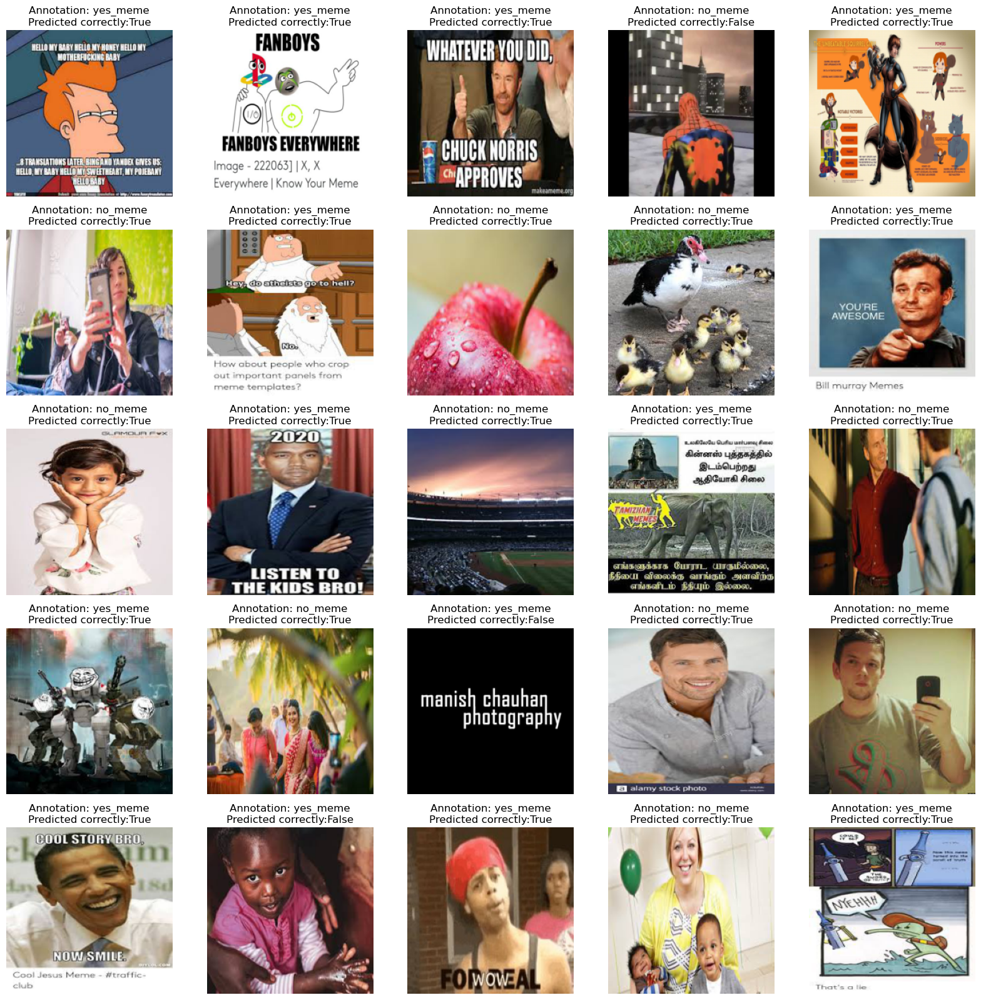

# meme_organiser

Meme manager for cell phones:

1. Classify images as meme or not (Completed)
   - Model can be downloaded from [here](https://drive.google.com/file/d/1oU1E5LyGQVKDZzgueycjdE15W6kaVxet/view?usp=sharing)

# Steps to run the model:
1. Download the model and save it in the `$ROOT` of the directory
2. Navigate to the `$ROOT` of the directory in terminal
3. Create conda environment using `environment.yml` using the command `conda env create -f environment.yml`
4. Activate the environment using the command `conda activate meme_org`
5. Run the python file using the command: `python3 test_meme_classifier.py --path name_of_model.pth`
Here, replace the name_of_model.pth with the actual name of the model that you saved in step 1

# Sample output:

# Future Improvements:

For all the images that are memes, create meta tags based on:
- [ ] Celebrity present in the meme (Pending)
- [ ] Popular meme templates and references (Pending)
- [ ] Text present in the meme
- [ ] Topic of conversation in the text (Pending)
- [ ] Sentiment analysis of the test (Pending)

- [ ] Store the image path and meta tags in a db (Pending)
- [ ] Provide an interface to retrieve the meme image from the db based on the meta tags via search (Pending)

Feel free to email me on rishabhgarodia@gmail.com if you want to collaborate on this project and take it forward